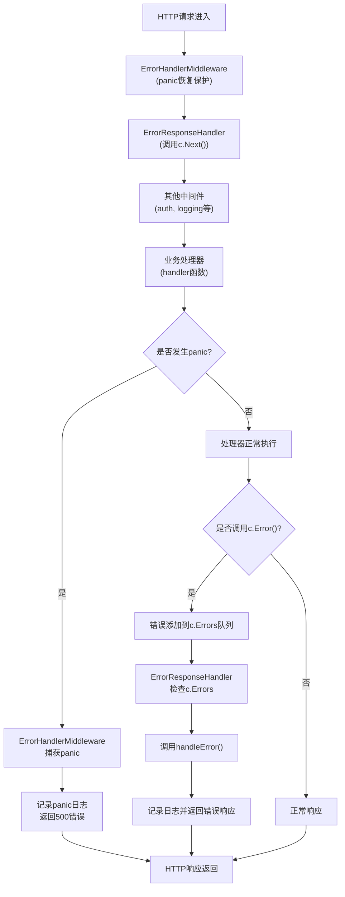

# 错误处理流程图

```mermaid
graph TD
    A["HTTP请求进入"] --> B["ErrorHandlerMiddleware<br/>(panic恢复保护)"]
    B --> C["ErrorResponseHandler<br/>(调用c.Next())"]
    C --> D["其他中间件<br/>(auth, logging等)"]
    D --> E["业务处理器<br/>(handler函数)"]
    
    E --> F{"是否发生panic?"}
    F -->|是| G["ErrorHandlerMiddleware<br/>捕获panic"]
    G --> H["记录panic日志<br/>返回500错误"]
    
    F -->|否| I["处理器正常执行"]
    I --> J{"是否调用c.Error()?"}
    J -->|是| K["错误添加到c.Errors队列"]
    J -->|否| L["正常响应"]
    
    K --> M["ErrorResponseHandler<br/>检查c.Errors"]
    M --> N["调用handleError()"]
    N --> O["记录日志并返回错误响应"]
    
    L --> P["HTTP响应返回"]
    H --> P
    O --> P
```