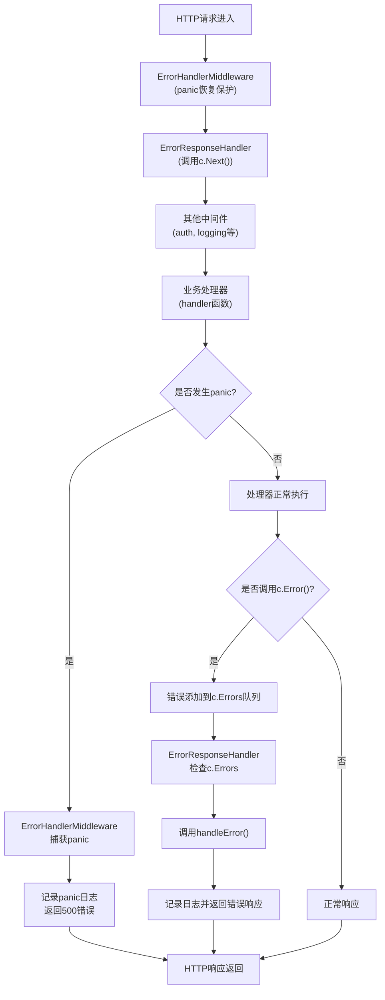
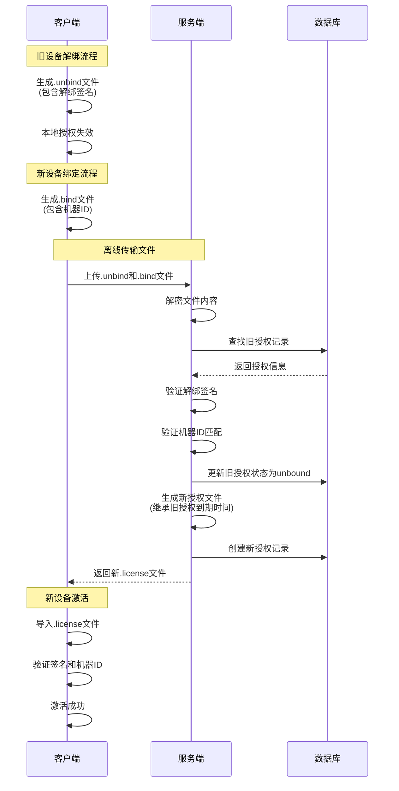

## 流程图

### 错误处理流程图

```mermaid
graph TD
    A["HTTP请求进入"] --> B["ErrorHandlerMiddleware<br/>(panic恢复保护)"]
    B --> C["ErrorResponseHandler<br/>(调用c.Next())"]
    C --> D["其他中间件<br/>(auth, logging等)"]
    D --> E["业务处理器<br/>(handler函数)"]
    
    E --> F{"是否发生panic?"}
    F -->|是| G["ErrorHandlerMiddleware<br/>捕获panic"]
    G --> H["记录panic日志<br/>返回500错误"]
    
    F -->|否| I["处理器正常执行"]
    I --> J{"是否调用c.Error()?"}
    J -->|是| K["错误添加到c.Errors队列"]
    J -->|否| L["正常响应"]
    
    K --> M["ErrorResponseHandler<br/>检查c.Errors"]
    M --> N["调用handleError()"]
    N --> O["记录日志并返回错误响应"]
    
    L --> P["HTTP响应返回"]
    H --> P
    O --> P
```

### 转移授权流程

```mermaid
sequenceDiagram
    participant C as 客户端
    participant S as 服务端
    participant DB as 数据库
    
    Note over C: 旧设备解绑流程
    C->>C: 生成.unbind文件<br/>(包含解绑签名)
    C->>C: 本地授权失效
    
    Note over C: 新设备绑定流程  
    C->>C: 生成.bind文件<br/>(包含机器ID)
    
    Note over C,S: 离线传输文件
    
    C->>S: 上传.unbind和.bind文件
    S->>S: 解密文件内容
    S->>DB: 查找旧授权记录
    DB-->>S: 返回授权信息
    S->>S: 验证解绑签名
    S->>S: 验证机器ID匹配
    S->>DB: 更新旧授权状态为unbound
    S->>S: 生成新授权文件<br/>(继承旧授权到期时间)
    S->>DB: 创建新授权记录
    S-->>C: 返回新.license文件
    
    Note over C: 新设备激活
    C->>C: 导入.license文件
    C->>C: 验证签名和机器ID
    C->>C: 激活成功
```