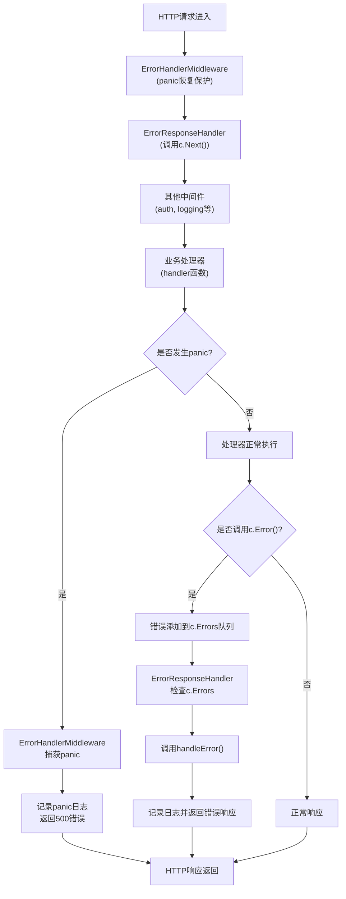
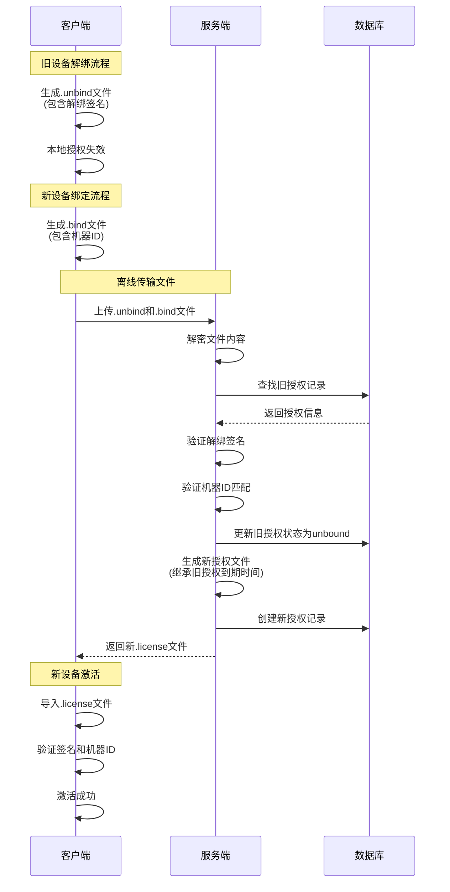
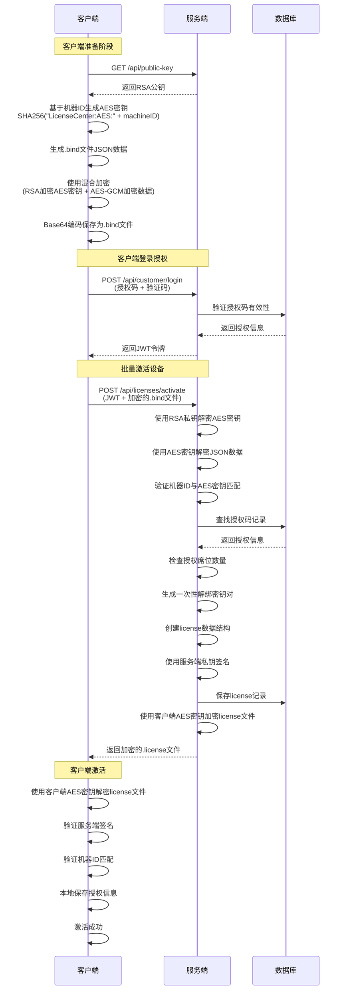
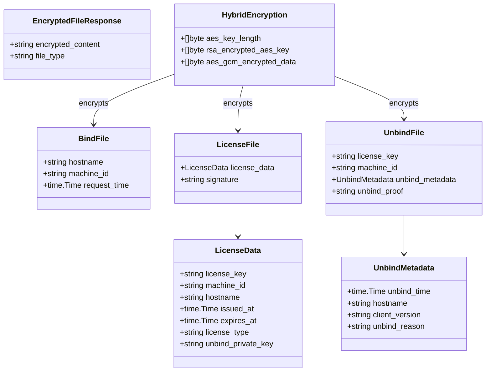
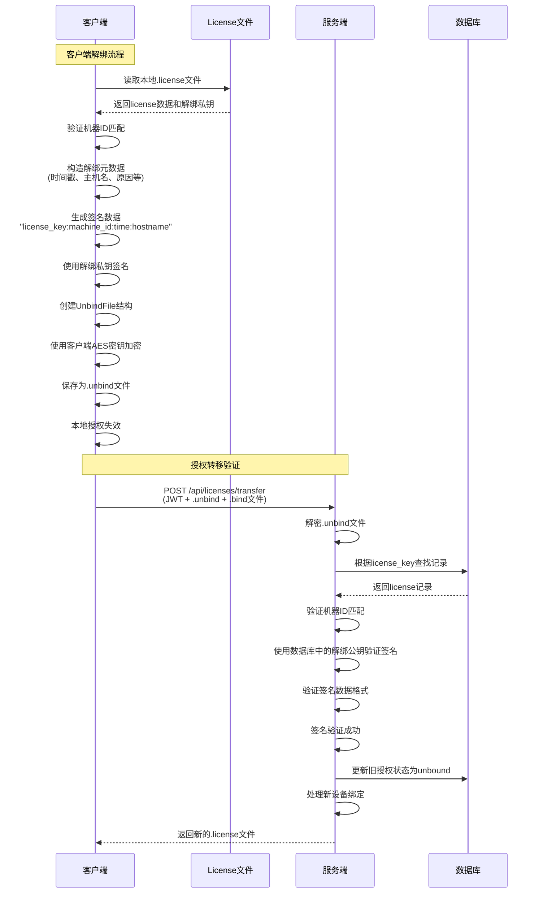
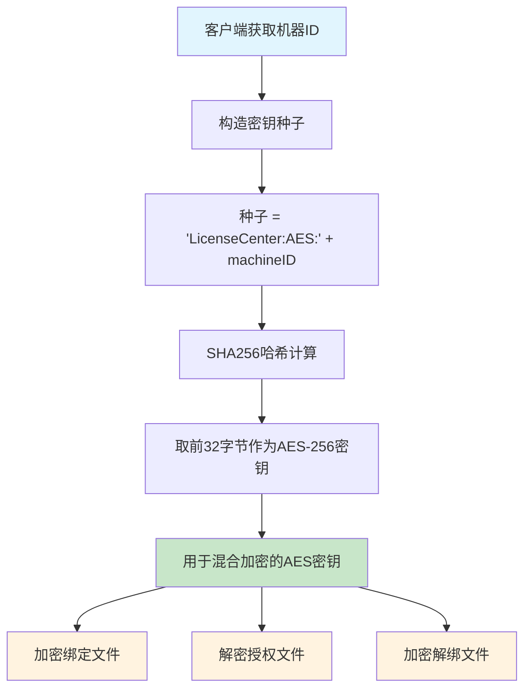
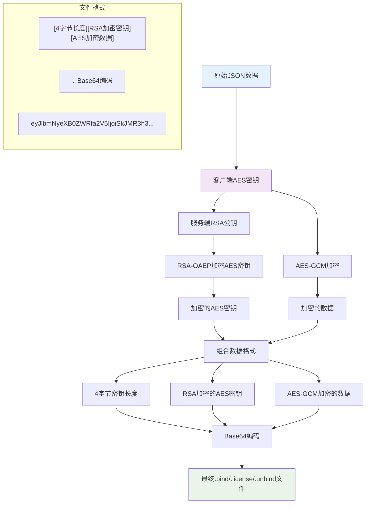
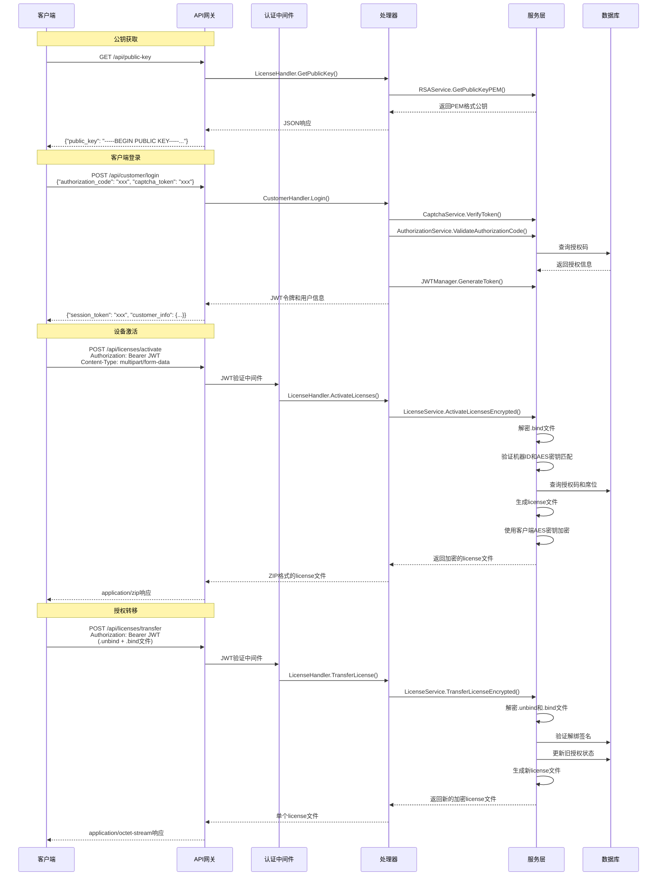
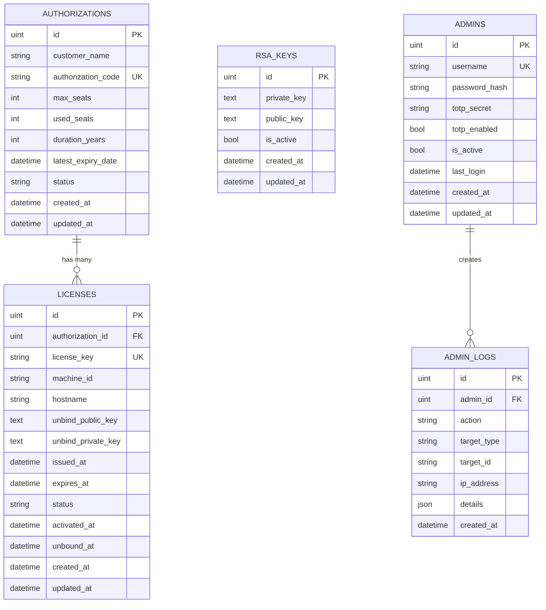
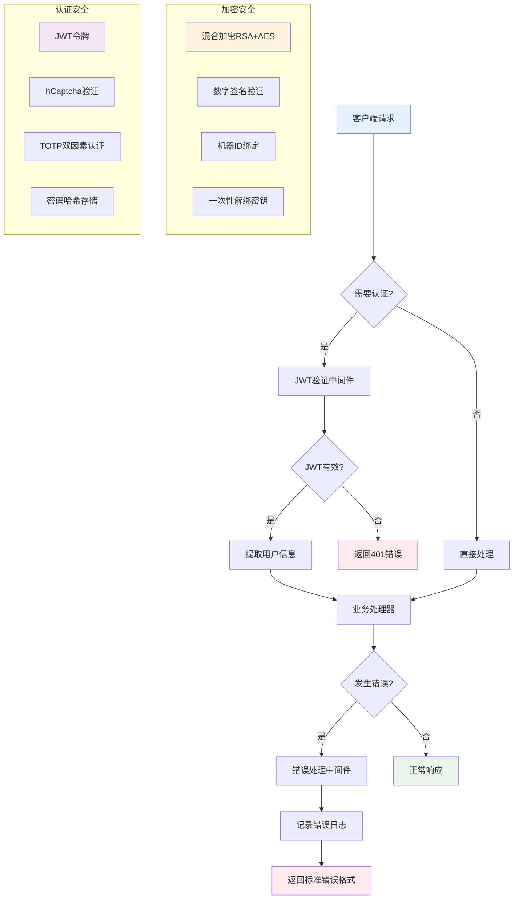

## 流程图

### 错误处理流程图

```mermaid
graph TD
    A["HTTP请求进入"] --> B["ErrorHandlerMiddleware<br/>(panic恢复保护)"]
    B --> C["ErrorResponseHandler<br/>(调用c.Next())"]
    C --> D["其他中间件<br/>(auth, logging等)"]
    D --> E["业务处理器<br/>(handler函数)"]
    
    E --> F{"是否发生panic?"}
    F -->|是| G["ErrorHandlerMiddleware<br/>捕获panic"]
    G --> H["记录panic日志<br/>返回500错误"]
    
    F -->|否| I["处理器正常执行"]
    I --> J{"是否调用c.Error()?"}
    J -->|是| K["错误添加到c.Errors队列"]
    J -->|否| L["正常响应"]
    
    K --> M["ErrorResponseHandler<br/>检查c.Errors"]
    M --> N["调用handleError()"]
    N --> O["记录日志并返回错误响应"]
    
    L --> P["HTTP响应返回"]
    H --> P
    O --> P
```

### 转移授权流程

```mermaid
sequenceDiagram
    participant C as 客户端
    participant S as 服务端
    participant DB as 数据库
    
    Note over C: 旧设备解绑流程
    C->>C: 生成.unbind文件<br/>(包含解绑签名)
    C->>C: 本地授权失效
    
    Note over C: 新设备绑定流程  
    C->>C: 生成.bind文件<br/>(包含机器ID)
    
    Note over C,S: 离线传输文件
    
    C->>S: 上传.unbind和.bind文件
    S->>S: 解密文件内容
    S->>DB: 查找旧授权记录
    DB-->>S: 返回授权信息
    S->>S: 验证解绑签名
    S->>S: 验证机器ID匹配
    S->>DB: 更新旧授权状态为unbound
    S->>S: 生成新授权文件<br/>(继承旧授权到期时间)
    S->>DB: 创建新授权记录
    S-->>C: 返回新.license文件
    
    Note over C: 新设备激活
    C->>C: 导入.license文件
    C->>C: 验证签名和机器ID
    C->>C: 激活成功
```

### 混合加密授权激活流程

```mermaid
sequenceDiagram
    participant C as 客户端
    participant S as 服务端
    participant DB as 数据库
    
    Note over C: 客户端准备阶段
    C->>S: GET /api/public-key
    S-->>C: 返回RSA公钥
    C->>C: 基于机器ID生成AES密钥<br/>SHA256("LicenseCenter:AES:" + machineID)
    C->>C: 生成.bind文件JSON数据
    C->>C: 使用混合加密<br/>(RSA加密AES密钥 + AES-GCM加密数据)
    C->>C: Base64编码保存为.bind文件
    
    Note over C,S: 客户端登录授权
    C->>S: POST /api/customer/login<br/>(授权码 + 验证码)
    S->>DB: 验证授权码有效性
    DB-->>S: 返回授权信息
    S-->>C: 返回JWT令牌
    
    Note over C,S: 批量激活设备
    C->>S: POST /api/licenses/activate<br/>(JWT + 加密的.bind文件)
    S->>S: 使用RSA私钥解密AES密钥
    S->>S: 使用AES密钥解密JSON数据
    S->>S: 验证机器ID与AES密钥匹配
    S->>DB: 查找授权码记录
    DB-->>S: 返回授权信息
    S->>S: 检查授权席位数量
    S->>S: 生成一次性解绑密钥对
    S->>S: 创建license数据结构
    S->>S: 使用服务端私钥签名
    S->>DB: 保存license记录
    S->>S: 使用客户端AES密钥加密license文件
    S-->>C: 返回加密的.license文件
    
    Note over C: 客户端激活
    C->>C: 使用客户端AES密钥解密license文件
    C->>C: 验证服务端签名
    C->>C: 验证机器ID匹配
    C->>C: 本地保存授权信息
    C->>C: 激活成功
```

### 公钥加密license文件数据结构

```mermaid
classDiagram
    class BindFile {
        +string hostname
        +string machine_id
        +time.Time request_time
    }
    
    class LicenseFile {
        +LicenseData license_data
        +string signature
    }
    
    class LicenseData {
        +string license_key
        +string machine_id
        +string hostname
        +time.Time issued_at
        +time.Time expires_at
        +string license_type
        +string unbind_private_key
    }
    
    class UnbindFile {
        +string license_key
        +string machine_id
        +UnbindMetadata unbind_metadata
        +string unbind_proof
    }
    
    class UnbindMetadata {
        +time.Time unbind_time
        +string hostname
        +string client_version
        +string unbind_reason
    }
    
    class EncryptedFileResponse {
        +string encrypted_content
        +string file_type
    }
    
    class HybridEncryption {
        +[]byte aes_key_length
        +[]byte rsa_encrypted_aes_key
        +[]byte aes_gcm_encrypted_data
    }
    
    LicenseFile --> LicenseData
    UnbindFile --> UnbindMetadata
    HybridEncryption --> BindFile : encrypts
    HybridEncryption --> LicenseFile : encrypts
    HybridEncryption --> UnbindFile : encrypts
```

### 解绑文件生成和验证流程

```mermaid
sequenceDiagram
    participant C as 客户端
    participant L as License文件
    participant S as 服务端
    participant DB as 数据库
    
    Note over C: 客户端解绑流程
    C->>L: 读取本地.license文件
    L-->>C: 返回license数据和解绑私钥
    C->>C: 验证机器ID匹配
    C->>C: 构造解绑元数据<br/>(时间戳、主机名、原因等)
    C->>C: 生成签名数据<br/>"license_key:machine_id:time:hostname"
    C->>C: 使用解绑私钥签名
    C->>C: 创建UnbindFile结构
    C->>C: 使用客户端AES密钥加密
    C->>C: 保存为.unbind文件
    C->>C: 本地授权失效
    
    Note over C,S: 授权转移验证
    C->>S: POST /api/licenses/transfer<br/>(JWT + .unbind + .bind文件)
    S->>S: 解密.unbind文件
    S->>DB: 根据license_key查找记录
    DB-->>S: 返回license记录
    S->>S: 验证机器ID匹配
    S->>S: 使用数据库中的解绑公钥验证签名
    S->>S: 验证签名数据格式
    S->>S: 签名验证成功
    S->>DB: 更新旧授权状态为unbound
    S->>S: 处理新设备绑定
    S-->>C: 返回新的.license文件
```

### 客户端AES密钥生成机制

```mermaid
graph TD
    A[客户端获取机器ID] --> B[构造密钥种子]
    B --> C["种子 = 'LicenseCenter:AES:' + machineID"]
    C --> D[SHA256哈希计算]
    D --> E[取前32字节作为AES-256密钥]
    E --> F[用于混合加密的AES密钥]
    
    F --> G[加密绑定文件]
    F --> H[解密授权文件]
    F --> I[加密解绑文件]
    
    style A fill:#e1f5fe
    style F fill:#c8e6c9
    style G fill:#fff3e0
    style H fill:#fff3e0
    style I fill:#fff3e0
```

### 混合加密文件格式详解

```mermaid
graph TD
    A[原始JSON数据] --> B[客户端AES密钥]
    B --> C[AES-GCM加密]
    C --> D[加密的数据]
    
    B --> E[服务端RSA公钥]
    E --> F[RSA-OAEP加密AES密钥]
    F --> G[加密的AES密钥]
    
    G --> H[组合数据格式]
    D --> H
    H --> I[4字节密钥长度]
    H --> J[RSA加密的AES密钥]
    H --> K[AES-GCM加密的数据]
    
    I --> L[Base64编码]
    J --> L
    K --> L
    L --> M[最终.bind/.license/.unbind文件]
    
    style A fill:#e3f2fd
    style B fill:#f3e5f5
    style M fill:#e8f5e8
    
    subgraph "文件格式"
        N["[4字节长度][RSA加密密钥][AES加密数据]"]
        O["↓ Base64编码"]
        P["eyJlbmNyeXB0ZWRfa2V5IjoiSkJMR3h3..."]
    end
```

### API接口交互流程

```mermaid
sequenceDiagram
    participant C as 客户端
    participant API as API网关
    participant Auth as 认证中间件
    participant H as 处理器
    participant S as 服务层
    participant DB as 数据库
    
    Note over C,API: 公钥获取
    C->>API: GET /api/public-key
    API->>H: LicenseHandler.GetPublicKey()
    H->>S: RSAService.GetPublicKeyPEM()
    S-->>H: 返回PEM格式公钥
    H-->>API: JSON响应
    API-->>C: {"public_key": "-----BEGIN PUBLIC KEY-----..."}
    
    Note over C,API: 客户端登录
    C->>API: POST /api/customer/login<br/>{"authorization_code": "xxx", "captcha_token": "xxx"}
    API->>H: CustomerHandler.Login()
    H->>S: CaptchaService.VerifyToken()
    H->>S: AuthorizationService.ValidateAuthorizationCode()
    S->>DB: 查询授权码
    DB-->>S: 返回授权信息
    H->>S: JWTManager.GenerateToken()
    H-->>API: JWT令牌和用户信息
    API-->>C: {"session_token": "xxx", "customer_info": {...}}
    
    Note over C,API: 设备激活
    C->>API: POST /api/licenses/activate<br/>Authorization: Bearer JWT<br/>Content-Type: multipart/form-data
    API->>Auth: JWT验证中间件
    Auth->>H: LicenseHandler.ActivateLicenses()
    H->>S: LicenseService.ActivateLicensesEncrypted()
    S->>S: 解密.bind文件
    S->>S: 验证机器ID和AES密钥匹配
    S->>DB: 查询授权码和席位
    S->>S: 生成license文件
    S->>S: 使用客户端AES密钥加密
    S-->>H: 返回加密的license文件
    H-->>API: ZIP格式的license文件
    API-->>C: application/zip响应
    
    Note over C,API: 授权转移
    C->>API: POST /api/licenses/transfer<br/>Authorization: Bearer JWT<br/>(.unbind + .bind文件)
    API->>Auth: JWT验证中间件
    Auth->>H: LicenseHandler.TransferLicense()
    H->>S: LicenseService.TransferLicenseEncrypted()
    S->>S: 解密.unbind和.bind文件
    S->>DB: 验证解绑签名
    S->>DB: 更新旧授权状态
    S->>S: 生成新license文件
    S-->>H: 返回新的加密license文件
    H-->>API: 单个license文件
    API-->>C: application/octet-stream响应
```

### 数据库模型关系图

```mermaid
erDiagram
    AUTHORIZATIONS {
        uint id PK
        string customer_name
        string authorization_code UK
        int max_seats
        int used_seats
        int duration_years
        datetime latest_expiry_date
        string status
        datetime created_at
        datetime updated_at
    }
    
    LICENSES {
        uint id PK
        uint authorization_id FK
        string license_key UK
        string machine_id
        string hostname
        text unbind_public_key
        text unbind_private_key
        datetime issued_at
        datetime expires_at
        string status
        datetime activated_at
        datetime unbound_at
        datetime created_at
        datetime updated_at
    }
    
    RSA_KEYS {
        uint id PK
        text private_key
        text public_key
        bool is_active
        datetime created_at
        datetime updated_at
    }
    
    ADMINS {
        uint id PK
        string username UK
        string password_hash
        string totp_secret
        bool totp_enabled
        bool is_active
        datetime last_login
        datetime created_at
        datetime updated_at
    }
    
    ADMIN_LOGS {
        uint id PK
        uint admin_id FK
        string action
        string target_type
        string target_id
        string ip_address
        json details
        datetime created_at
    }
    
    AUTHORIZATIONS ||--o{ LICENSES : "has many"
    ADMINS ||--o{ ADMIN_LOGS : "creates"
```

### 系统安全机制流程

```mermaid
graph TD
    A[客户端请求] --> B{需要认证?}
    B -->|是| C[JWT验证中间件]
    B -->|否| D[直接处理]
    
    C --> E{JWT有效?}
    E -->|否| F[返回401错误]
    E -->|是| G[提取用户信息]
    
    G --> H[业务处理器]
    D --> H
    
    H --> I{发生错误?}
    I -->|是| J[错误处理中间件]
    I -->|否| K[正常响应]
    
    J --> L[记录错误日志]
    L --> M[返回标准错误格式]
    
    subgraph "加密安全"
        N[混合加密RSA+AES]
        O[数字签名验证]
        P[机器ID绑定]
        Q[一次性解绑密钥]
    end
    
    subgraph "认证安全"
        R[JWT令牌]
        S[hCaptcha验证]
        T[TOTP双因素认证]
        U[密码哈希存储]
    end
    
    style A fill:#e3f2fd
    style F fill:#ffebee
    style M fill:#ffebee
    style K fill:#e8f5e8
    style N fill:#fff3e0
    style R fill:#f3e5f5
```